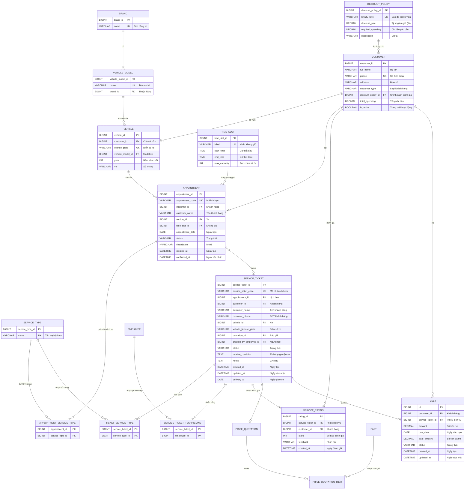
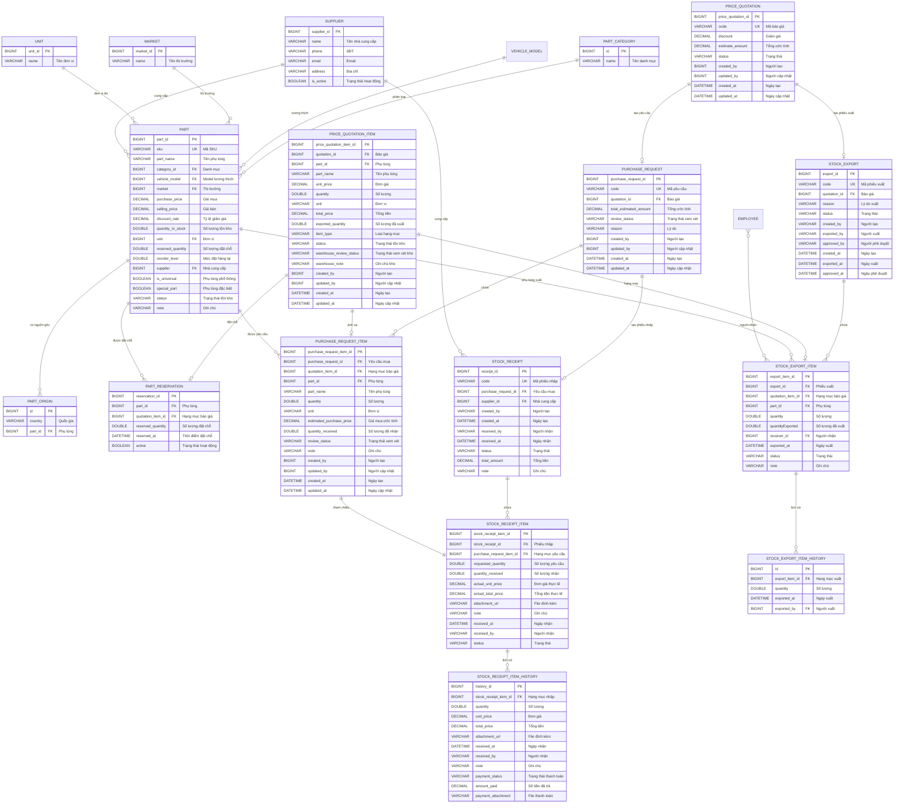

# ERD Overview - Garage Management System

Lưu ý hiển thị:
- File sử dụng Mermaid (erDiagram). Trên GitHub bạn có thể xem trực tiếp, hoặc mở bằng VS Code với extension "Markdown Preview Mermaid Support".
- Ký hiệu quan hệ: `||` = 1 (bắt buộc), `o|` = 0..1 (tùy chọn), `|{` = 1..N (một đến nhiều), `o{` = 0..N (không hoặc nhiều). Các bảng trung gian thể hiện quan hệ N-N.

## Sơ đồ ERD tổng hợp (Tất cả 46 bảng)

```mermaid
erDiagram
    %% Core: Khách hàng, Xe, Lịch hẹn
  BRAND ||--|{ VEHICLE_MODEL : has
    VEHICLE_MODEL ||--o{ VEHICLE : model_of
  CUSTOMER ||--|{ VEHICLE : owns
  DISCOUNT_POLICY ||--o{ CUSTOMER : applied_to
    CUSTOMER ||--o{ APPOINTMENT : makes
  VEHICLE ||--o{ APPOINTMENT : for
  TIME_SLOT ||--o{ APPOINTMENT : scheduled_in
    APPOINTMENT ||--o{ APPOINTMENT_SERVICE_TYPE : requests
    SERVICE_TYPE ||--o{ APPOINTMENT_SERVICE_TYPE : requested_in

    %% Phiếu dịch vụ và Báo giá
  APPOINTMENT ||--o| SERVICE_TICKET : generates
  SERVICE_TICKET ||--o{ TICKET_SERVICE_TYPE : includes
    SERVICE_TYPE ||--o{ TICKET_SERVICE_TYPE : included_in
    SERVICE_TICKET ||--o{ SERVICE_TICKET_TECHNICIANS : assigns
    EMPLOYEE ||--o{ SERVICE_TICKET_TECHNICIANS : assigned_to
    SERVICE_TICKET ||--o{ SERVICE_RATING : rated_by
    CUSTOMER ||--o{ SERVICE_RATING : rates
    SERVICE_TICKET ||--o| PRICE_QUOTATION : has
    PRICE_QUOTATION ||--o{ PRICE_QUOTATION_ITEM : contains
    PRICE_QUOTATION_ITEM ||--o{ PART_RESERVATION : reserves
    
    %% Kho và Phụ tùng
    PART_CATEGORY ||--o{ PART : classifies
    VEHICLE_MODEL ||--o{ PART : compatible_with
    MARKET ||--o{ PART : origin
    UNIT ||--o{ PART : measured_by
    SUPPLIER ||--o{ PART : supplies
    PART ||--o{ PART_ORIGIN : has_origin
    PART ||--o{ PRICE_QUOTATION_ITEM : quoted_in
    PART ||--o{ PURCHASE_REQUEST_ITEM : requested_in
    PART ||--o{ STOCK_EXPORT_ITEM : exported_as
    
    %% Mua hàng và Nhập kho
    PRICE_QUOTATION ||--o| PURCHASE_REQUEST : creates
    PURCHASE_REQUEST ||--o{ PURCHASE_REQUEST_ITEM : contains
    PRICE_QUOTATION_ITEM ||--o{ PURCHASE_REQUEST_ITEM : maps_to
    PURCHASE_REQUEST ||--o| STOCK_RECEIPT : generates
    SUPPLIER ||--o{ STOCK_RECEIPT : supplies
    STOCK_RECEIPT ||--o{ STOCK_RECEIPT_ITEM : contains
    PURCHASE_REQUEST_ITEM ||--o{ STOCK_RECEIPT_ITEM : referenced_in
    STOCK_RECEIPT_ITEM ||--o{ STOCK_RECEIPT_ITEM_HISTORY : has_history
    
    %% Xuất kho
    PRICE_QUOTATION ||--o| STOCK_EXPORT : creates
    STOCK_EXPORT ||--o{ STOCK_EXPORT_ITEM : contains
    PRICE_QUOTATION_ITEM ||--o{ STOCK_EXPORT_ITEM : exported_as
    EMPLOYEE ||--o{ STOCK_EXPORT_ITEM : receives
    STOCK_EXPORT_ITEM ||--o{ STOCK_EXPORT_ITEM_HISTORY : has_history
    
    %% Tài chính và Thanh toán
    PRICE_QUOTATION ||--o| INVOICE : generates
    SERVICE_TICKET ||--o| INVOICE : has
    INVOICE ||--o{ TRANSACTION : paid_by
  CUSTOMER ||--o{ DEBT : owes
    SERVICE_TICKET ||--o| DEBT : creates
    DEBT ||--o{ TRANSACTION : settled_by
    
    %% Nhân viên và Lương
    ACCOUNT ||--o| EMPLOYEE : linked_to
    EMPLOYEE ||--o{ PAYROLL : has
    EMPLOYEE ||--o{ ALLOWANCE : receives
    EMPLOYEE ||--o{ DEDUCTION : charged
    EMPLOYEE ||--o{ ATTENDANCE : records
    EMPLOYEE ||--o{ NOTIFICATION : receives
    EMPLOYEE ||--o{ LEDGER_VOUCHER : creates_approves
    STOCK_RECEIPT_ITEM_HISTORY ||--o| LEDGER_VOUCHER : linked_to
    
    %% Entity Definitions
  BRAND {
    BIGINT brand_id PK
        VARCHAR name UK
  }

  VEHICLE_MODEL {
    BIGINT vehicle_model_id PK
        VARCHAR name UK
    BIGINT brand_id FK
  }

  CUSTOMER {
    BIGINT customer_id PK
    VARCHAR full_name
        VARCHAR phone UK
    VARCHAR address
    VARCHAR customer_type
    BIGINT discount_policy_id FK
    DECIMAL total_spending
        BOOLEAN is_active
  }

  VEHICLE {
    BIGINT vehicle_id PK
    BIGINT customer_id FK
        VARCHAR license_plate UK
    BIGINT vehicle_model_id FK
    INT year
    VARCHAR vin
  }

  TIME_SLOT {
    BIGINT time_slot_id PK
        VARCHAR label UK
    TIME start_time
    TIME end_time
    INT max_capacity
  }

  APPOINTMENT {
    BIGINT appointment_id PK
        VARCHAR appointment_code UK
    BIGINT customer_id FK
    BIGINT vehicle_id FK
    BIGINT time_slot_id FK
    DATE appointment_date
    VARCHAR status
    DATETIME created_at
  }

  SERVICE_TYPE {
    BIGINT service_type_id PK
        VARCHAR name UK
  }

  APPOINTMENT_SERVICE_TYPE {
        BIGINT appointment_id PK
        BIGINT service_type_id PK
  }

  SERVICE_TICKET {
    BIGINT service_ticket_id PK
        VARCHAR service_ticket_code UK
        BIGINT appointment_id FK
    BIGINT customer_id FK
    BIGINT vehicle_id FK
    BIGINT quotation_id FK
        BIGINT created_by_employee_id FK
    VARCHAR status
    DATETIME created_at
  }

  TICKET_SERVICE_TYPE {
        BIGINT service_ticket_id PK
        BIGINT service_type_id PK
  }

  SERVICE_TICKET_TECHNICIANS {
        BIGINT service_ticket_id PK
    BIGINT employee_id PK
    }
    
    SERVICE_RATING {
        BIGINT rating_id PK
        BIGINT service_ticket_id FK
        BIGINT customer_id FK
        INT stars
        VARCHAR feedback
  }

  DISCOUNT_POLICY {
    BIGINT discount_policy_id PK
        VARCHAR loyalty_level UK
    DECIMAL discount_rate
    DECIMAL required_spending
  }

  DEBT {
    BIGINT id PK
    BIGINT customer_id FK
    BIGINT service_ticket_id FK
    DECIMAL amount
    DATE due_date
    DECIMAL paid_amount
    VARCHAR status
    }
    
    PRICE_QUOTATION {
        BIGINT price_quotation_id PK
        VARCHAR code UK
        DECIMAL discount
        DECIMAL estimate_amount
        VARCHAR status
    }
    
    PRICE_QUOTATION_ITEM {
        BIGINT price_quotation_item_id PK
        BIGINT quotation_id FK
        BIGINT part_id FK
        DECIMAL unit_price
        DOUBLE quantity
        DECIMAL total_price
    }

  PART {
    BIGINT part_id PK
        VARCHAR sku UK
    VARCHAR part_name
    BIGINT category_id FK
    BIGINT vehicle_model FK
    BIGINT market FK
        BIGINT unit FK
        BIGINT supplier FK
    DECIMAL purchase_price
    DECIMAL selling_price
    DOUBLE quantity_in_stock
    }
    
    PART_CATEGORY {
        BIGINT id PK
        VARCHAR name
  }

  PART_ORIGIN {
    BIGINT id PK
    VARCHAR country
    BIGINT part_id FK
  }
    
    MARKET {
        BIGINT market_id PK
        VARCHAR name
    }
    
    UNIT {
        BIGINT unit_id PK
        VARCHAR name
    }
    
    SUPPLIER {
        BIGINT supplier_id PK
        VARCHAR name
        VARCHAR phone
        VARCHAR email
        VARCHAR address
        BOOLEAN is_active
    }

  PART_RESERVATION {
    BIGINT reservation_id PK
    BIGINT part_id FK
    BIGINT quotation_item_id FK
    DOUBLE reserved_quantity
        BOOLEAN active
  }

  PURCHASE_REQUEST {
    BIGINT purchase_request_id PK
        VARCHAR code UK
    BIGINT quotation_id FK
    DECIMAL total_estimated_amount
    VARCHAR review_status
  }

  PURCHASE_REQUEST_ITEM {
    BIGINT purchase_request_item_id PK
    BIGINT purchase_request_id FK
    BIGINT quotation_item_id FK
    BIGINT part_id FK
    DOUBLE quantity
    DECIMAL estimated_purchase_price
  }

  STOCK_RECEIPT {
    BIGINT receipt_id PK
        VARCHAR code UK
    BIGINT purchase_request_id FK
        BIGINT supplier_id FK
    VARCHAR status
    DECIMAL total_amount
  }

  STOCK_RECEIPT_ITEM {
    BIGINT stock_receipt_item_id PK
    BIGINT stock_receipt_id FK
    BIGINT purchase_request_item_id FK
    DOUBLE quantity_received
    DECIMAL actual_unit_price
    DECIMAL actual_total_price
        VARCHAR status
    }
    
    STOCK_RECEIPT_ITEM_HISTORY {
        BIGINT history_id PK
        BIGINT stock_receipt_item_id FK
        DOUBLE quantity
        DECIMAL unit_price
        DECIMAL total_price
        VARCHAR payment_status
        DECIMAL amount_paid
  }

  STOCK_EXPORT {
    BIGINT export_id PK
        VARCHAR code UK
    BIGINT quotation_id FK
        VARCHAR status
  }

  STOCK_EXPORT_ITEM {
    BIGINT export_item_id PK
    BIGINT export_id FK
    BIGINT quotation_item_id FK
        BIGINT part_id FK
    DOUBLE quantity
    BIGINT receiver_id FK
        VARCHAR status
    }
    
    STOCK_EXPORT_ITEM_HISTORY {
        BIGINT id PK
        BIGINT export_item_id FK
        DOUBLE quantity
        DATETIME exported_at
        BIGINT exported_by FK
    }

  INVOICE {
    BIGINT id PK
    VARCHAR code
    BIGINT price_quotation_id FK
    BIGINT service_ticket_id FK
    DECIMAL deposit_received
    DECIMAL final_amount
    VARCHAR status
  }

  TRANSACTION {
    BIGINT id PK
    VARCHAR payment_link_id
    BIGINT invoice_id FK
    BIGINT debt_id FK
    VARCHAR method
    VARCHAR type
    BIGINT amount
    }
    
    ACCOUNT {
        BIGINT account_id PK
        VARCHAR phone UK
        VARCHAR role
        VARCHAR password
        BOOLEAN active
    }
    
    EMPLOYEE {
        BIGINT employee_id PK
        VARCHAR full_name
        VARCHAR phone UK
        BIGINT account_id FK
        DECIMAL daily_salary
        VARCHAR status
    }
    
    PAYROLL {
        BIGINT payroll_id PK
        BIGINT employee_id FK
        INT month
        INT year
        DECIMAL base_salary
        DECIMAL net_salary
        VARCHAR status
    }
    
    ALLOWANCE {
        BIGINT allowance_id PK
        BIGINT employee_id FK
        VARCHAR type
        DECIMAL amount
        INT month
        INT year
    }
    
    DEDUCTION {
        BIGINT deduction_id PK
        BIGINT employee_id FK
        VARCHAR type
        DECIMAL amount
        VARCHAR reason
    }
    
    ATTENDANCE {
        BIGINT attendance_id PK
        BIGINT employee_id FK
        DATE date UK
        BOOLEAN is_present
    }
    
    NOTIFICATION {
        BIGINT id PK
        BIGINT receiver_id FK
        VARCHAR type
        VARCHAR title
        VARCHAR message
        VARCHAR status
    }
    
    LEDGER_VOUCHER {
        BIGINT ledger_id PK
        VARCHAR code UK
        VARCHAR type
        DECIMAL amount
        BIGINT created_by_employee_id FK
        BIGINT approved_by_employee_id FK
        BIGINT receipt_history_id FK
        VARCHAR status
    }
    
    OTP_VERIFICATION {
        BIGINT otp_id PK
        VARCHAR phone
        VARCHAR otp_code
        DATETIME expires_at
        BOOLEAN is_verified
    }
    
    CODE_SEQUENCE {
        VARCHAR prefix PK
        INT year PK
        BIGINT current_value
    }
    
    ACCESS_TOKEN {
        BIGINT id PK
        VARCHAR access_token
        VARCHAR refresh_token
    }
    
    DISCOUNT {
        BIGINT id PK
        VARCHAR code UK
        VARCHAR name
        VARCHAR type
        DECIMAL value
        DATETIME expired_at
    }
    
    ONE_TIME_TOKEN {
        BIGINT id PK
        TEXT token
        VARCHAR expires_at
    }
```

## Mô tả các quan hệ chính trong hệ thống

Dựa trên ERD.puml, hệ thống có **46 bảng** được tổ chức thành 8 nhóm chức năng chính. Dưới đây là mô tả chi tiết các quan hệ giữa các bảng:

---

### 1. Core Entities - Quản lý Khách hàng, Xe và Lịch hẹn

#### Quan hệ Hãng xe và Model
- **BRAND → VEHICLE_MODEL** (1-N): Một hãng xe có nhiều model xe. Quan hệ bắt buộc, mỗi model phải thuộc về một hãng.
- **VEHICLE_MODEL → VEHICLE** (1-N): Một model xe có thể được sử dụng bởi nhiều xe. Một xe thuộc 1 model xe và 1 model có nhiều xe. Quan hệ tùy chọn, một xe có thể không có model cụ thể.

#### Quan hệ Khách hàng và Xe
- **CUSTOMER → VEHICLE** (1-N): Một khách hàng sở hữu nhiều xe. Quan hệ bắt buộc, mỗi xe phải thuộc về một khách hàng.
- **DISCOUNT_POLICY → CUSTOMER** (1-N): Một chính sách giảm giá áp dụng cho nhiều khách hàng. Quan hệ tùy chọn, khách hàng có thể không có chính sách giảm giá.

#### Quan hệ Lịch hẹn (Appointment)
- **CUSTOMER → APPOINTMENT** (1-N): Một khách hàng có thể đặt nhiều lịch hẹn. Quan hệ tùy chọn.
- **VEHICLE → APPOINTMENT** (1-N): Một xe có thể có nhiều lịch hẹn. Quan hệ tùy chọn.
- **TIME_SLOT → APPOINTMENT** (1-N): Một khung giờ có thể chứa nhiều lịch hẹn. Quan hệ tùy chọn.
- **APPOINTMENT → APPOINTMENT_SERVICE_TYPE** (1-N): Một lịch hẹn yêu cầu nhiều loại dịch vụ. Quan hệ N-N qua bảng trung gian.
- **SERVICE_TYPE → APPOINTMENT_SERVICE_TYPE** (1-N): Một loại dịch vụ có thể được yêu cầu trong nhiều lịch hẹn. Quan hệ N-N qua bảng trung gian.

---

### 2. Service & Quotation - Quản lý Dịch vụ và Báo giá

#### Quan hệ Phiếu dịch vụ (Service Ticket)
- **APPOINTMENT → SERVICE_TICKET** (0..1-0..1): Một lịch hẹn có thể tạo ra một phiếu dịch vụ hoặc không. Một phiếu dịch vụ có thể được tạo từ một lịch hẹn hoặc không. Quan hệ một-một tùy chọn ở cả hai phía: không phải mọi lịch hẹn đều tạo phiếu dịch vụ, và không phải mọi phiếu dịch vụ đều được tạo từ lịch hẹn.
- **SERVICE_TICKET → TICKET_SERVICE_TYPE** (1-N): Một phiếu dịch vụ bao gồm nhiều loại dịch vụ. Quan hệ N-N qua bảng trung gian.
- **SERVICE_TYPE → TICKET_SERVICE_TYPE** (1-N): Một loại dịch vụ có thể được sử dụng trong nhiều phiếu dịch vụ. Quan hệ N-N qua bảng trung gian.
- **SERVICE_TICKET → SERVICE_TICKET_TECHNICIANS** (1-N): Một phiếu dịch vụ phân công nhiều kỹ thuật viên. Quan hệ N-N qua bảng trung gian.
- **EMPLOYEE → SERVICE_TICKET_TECHNICIANS** (1-N): Một nhân viên có thể được phân công vào nhiều phiếu dịch vụ. Quan hệ N-N qua bảng trung gian.
- **SERVICE_TICKET → SERVICE_RATING** (1-0..1): Một phiếu dịch vụ chỉ có một đánh giá. Quan hệ một-một tùy chọn.
- **CUSTOMER → SERVICE_RATING** (1-N): Một khách hàng có thể đánh giá nhiều phiếu dịch vụ. Quan hệ tùy chọn.

#### Quan hệ Báo giá (Price Quotation)
- **SERVICE_TICKET → PRICE_QUOTATION** (1-1): Một phiếu dịch vụ có một báo giá. Quan hệ một-một tùy chọn.
- **PRICE_QUOTATION → PRICE_QUOTATION_ITEM** (1-N): Một báo giá chứa nhiều hạng mục. Quan hệ một-nhiều bắt buộc.
- **PRICE_QUOTATION_ITEM → PART_RESERVATION** (1-0..1): Một hạng mục báo giá chỉ có một đặt chỗ phụ tùng hoặc không có. Quan hệ một-một tùy chọn, dùng để giữ chỗ phụ tùng trong kho.
---

### 3. Inventory & Parts - Quản lý Kho và Phụ tùng

#### Quan hệ Phụ tùng (Part)
- **PART_CATEGORY → PART** (1-N): Một danh mục phụ tùng chứa nhiều phụ tùng. Quan hệ tùy chọn.
- **VEHICLE_MODEL → PART** (1-N): Một model xe tương thích với nhiều phụ tùng. Quan hệ tùy chọn, một số phụ tùng có thể phổ thông (universal).
- **MARKET → PART** (1-N): Một thị trường có nhiều phụ tùng. Quan hệ tùy chọn.
- **UNIT → PART** (1-N): Một đơn vị đo được dùng bởi nhiều phụ tùng. Quan hệ tùy chọn.
- **SUPPLIER → PART** (1-N): Một nhà cung cấp cung cấp nhiều phụ tùng. Quan hệ tùy chọn.
- **PART → PART_ORIGIN** (1-N): Một phụ tùng có thể có nhiều nguồn gốc (quốc gia). Quan hệ tùy chọn.

#### Quan hệ Phụ tùng với các bảng khác
- **PART → PRICE_QUOTATION_ITEM** (1-N): Một phụ tùng có thể được báo giá trong nhiều hạng mục báo giá. Quan hệ tùy chọn.
- **PART → PURCHASE_REQUEST_ITEM** (1-N): Một phụ tùng có thể được yêu cầu mua trong nhiều hạng mục yêu cầu. Quan hệ tùy chọn.
- **PART → STOCK_EXPORT_ITEM** (1-N): Một phụ tùng có thể được xuất kho trong nhiều hạng mục xuất. Quan hệ tùy chọn.

---

### 4. Purchase & Receipt - Quản lý Mua hàng và Nhập kho

#### Quan hệ Yêu cầu mua hàng (Purchase Request)
- **PRICE_QUOTATION → PURCHASE_REQUEST** (1-1): Một báo giá có thể tạo một yêu cầu mua hàng. Quan hệ một-một tùy chọn, chỉ khi cần mua phụ tùng không có sẵn.
- **PURCHASE_REQUEST → PURCHASE_REQUEST_ITEM** (1-N): Một yêu cầu mua hàng chứa nhiều hạng mục. Quan hệ một-nhiều bắt buộc.
- **PRICE_QUOTATION_ITEM → PURCHASE_REQUEST_ITEM** (1-0..1): Một hạng mục báo giá chỉ sinh ra một hạng mục yêu cầu mua. Quan hệ một-một tùy chọn.

#### Quan hệ Phiếu nhập kho (Stock Receipt)
- **PURCHASE_REQUEST → STOCK_RECEIPT** (1-1): Một yêu cầu mua hàng tạo ra một phiếu nhập kho. Quan hệ một-một tùy chọn, chỉ khi yêu cầu được duyệt và nhập kho.
- **SUPPLIER → STOCK_RECEIPT** (1-N): Một nhà cung cấp cung cấp nhiều phiếu nhập kho. Quan hệ tùy chọn.
- **STOCK_RECEIPT → STOCK_RECEIPT_ITEM** (1-N): Một phiếu nhập kho chứa nhiều hạng mục. Quan hệ một-nhiều bắt buộc.
- **PURCHASE_REQUEST_ITEM → STOCK_RECEIPT_ITEM** (1-1): Một hạng mục yêu cầu mua phải được tham chiếu trong một hạng mục nhập kho. Quan hệ một-một bắt buộc: khi nhập kho, mỗi hạng mục yêu cầu mua phải có một hạng mục nhập kho tương ứng.
- **STOCK_RECEIPT_ITEM → STOCK_RECEIPT_ITEM_HISTORY** (1-N): Một hạng mục nhập kho có nhiều lịch sử thanh toán. Quan hệ tùy chọn, dùng để theo dõi các lần thanh toán từng phần.

---

### 5. Stock Export - Quản lý Xuất kho

#### Quan hệ Phiếu xuất kho (Stock Export)
- **PRICE_QUOTATION → STOCK_EXPORT** (1-1): Một báo giá có một phiếu xuất kho. Quan hệ một-một tùy chọn, chỉ khi cần xuất phụ tùng từ kho.
- **STOCK_EXPORT → STOCK_EXPORT_ITEM** (1-N): Một phiếu xuất kho chứa nhiều hạng mục. Quan hệ một-nhiều bắt buộc.
- **PRICE_QUOTATION_ITEM → STOCK_EXPORT_ITEM** (1-0..1): Một hạng mục báo giá chỉ được xuất trong một hạng mục xuất kho hoặc không được xuất. Quan hệ một-một tùy chọn: mỗi hạng mục báo giá chỉ được xuất một lần trong một phiếu xuất kho.
- **EMPLOYEE → STOCK_EXPORT_ITEM** (N-N): Một nhân viên có thể nhận nhiều hạng mục xuất kho và một hạng mục xuất kho có thể được nhận bởi nhiều nhân viên. Quan hệ nhiều-nhiều qua bảng trung gian, dùng để ghi nhận người nhận phụ tùng.
- **STOCK_EXPORT_ITEM → STOCK_EXPORT_ITEM_HISTORY** (1-N): Một hạng mục xuất kho có nhiều lịch sử xuất. Quan hệ tùy chọn, dùng để theo dõi các lần xuất từng phần.

---

### 6. Finance & Payment - Quản lý Tài chính và Thanh toán

#### Quan hệ Hóa đơn (Invoice)
- **PRICE_QUOTATION → INVOICE** (1-1): Một báo giá có thể tạo một hóa đơn. Quan hệ một-một tùy chọn, chỉ khi khách hàng chấp nhận báo giá.
- **SERVICE_TICKET → INVOICE** (1-1): Một phiếu dịch vụ có thể có một hóa đơn. Quan hệ một-một tùy chọn.
- **INVOICE → TRANSACTION** (1-N): Một hóa đơn có nhiều giao dịch thanh toán. Quan hệ tùy chọn, hỗ trợ thanh toán nhiều lần.

#### Quan hệ Nợ (Debt)
- **CUSTOMER → DEBT** (1-N): Một khách hàng có thể có nhiều khoản nợ. Quan hệ tùy chọn.
- **SERVICE_TICKET → DEBT** (1-1): Một phiếu dịch vụ có thể tạo một khoản nợ. Quan hệ một-một tùy chọn, chỉ khi khách hàng chưa thanh toán đủ.
- **DEBT → TRANSACTION** (1-N): Một khoản nợ có thể được thanh toán bằng nhiều giao dịch. Quan hệ tùy chọn, hỗ trợ trả nợ từng phần.

#### Quan hệ Giao dịch (Transaction)
- **INVOICE → TRANSACTION**: Giao dịch thanh toán cho hóa đơn.
- **DEBT → TRANSACTION**: Giao dịch thanh toán cho khoản nợ.
- Mỗi giao dịch chỉ liên kết với một trong hai: Invoice hoặc Debt.

---

### 7. Employee & Payroll - Quản lý Nhân viên và Lương

#### Quan hệ Tài khoản và Nhân viên
- **ACCOUNT → EMPLOYEE** (0..1-1): Một tài khoản liên kết với một nhân viên. Quan hệ một-một tùy chọn: có những employee không có account, và một account chỉ liên kết với một employee.

#### Quan hệ Lương (Payroll)
- **EMPLOYEE → PAYROLL** (1-N): Một nhân viên có nhiều bảng lương theo tháng. Quan hệ tùy chọn.
- **EMPLOYEE → ALLOWANCE** (1-N): Một nhân viên có nhiều phụ cấp. Quan hệ tùy chọn.
- **EMPLOYEE → DEDUCTION** (1-N): Một nhân viên có nhiều khoản khấu trừ. Quan hệ tùy chọn.
- **EMPLOYEE → ATTENDANCE** (1-N): Một nhân viên có nhiều bản ghi chấm công. Quan hệ tùy chọn.
- **EMPLOYEE → NOTIFICATION** (1-N): Một nhân viên nhận nhiều thông báo. Quan hệ tùy chọn.
- **EMPLOYEE → LEDGER_VOUCHER** (1-0..N): Một nhân viên có thể tạo/phê duyệt nhiều phiếu chi hoặc không có phiếu chi nào. Quan hệ tùy chọn, thể hiện vai trò tạo hoặc phê duyệt.

---

### 8. System & Auth - Hệ thống và Xác thực

#### Quan hệ Xác thực
- **OTP_VERIFICATION**: Bảng độc lập, không có quan hệ với các bảng khác. Dùng để lưu mã OTP cho các chức năng xác thực.
- **CODE_SEQUENCE**: Bảng độc lập, không có quan hệ với các bảng khác. Dùng để quản lý mã tự động tăng cho các bảng khác.
- **ACCESS_TOKEN**: Bảng độc lập, không có quan hệ với các bảng khác. Dùng để lưu token truy cập Zalo.
- **ONE_TIME_TOKEN**: Bảng độc lập, không có quan hệ với các bảng khác. Dùng để quản lý token một lần (có thể cho reset password hoặc các chức năng xác thực khác).

---

### 9. Quan hệ đặc biệt và bổ sung

#### Quan hệ Chi phí và Chứng từ
- **STOCK_RECEIPT_ITEM_HISTORY → LEDGER_VOUCHER** (1-1): Một lịch sử nhập kho có thể liên kết với một phiếu chi. Quan hệ một-một tùy chọn, dùng để liên kết thanh toán với phiếu chi.

#### Các quan hệ quan trọng khác
- **PART → PRICE_QUOTATION_ITEM**: Phụ tùng được sử dụng trong báo giá.
- **PART → PURCHASE_REQUEST_ITEM**: Phụ tùng được yêu cầu mua khi không có sẵn.
- **PART → STOCK_EXPORT_ITEM**: Phụ tùng được xuất từ kho để sử dụng.

---

## Tóm tắt các loại quan hệ

### Quan hệ 1-1 (Một-một) hoặc 1-0..1 (Một-không hoặc một)
- `APPOINTMENT → SERVICE_TICKET` (0..1-0..1): Một lịch hẹn có thể tạo một phiếu dịch vụ hoặc không, và một phiếu dịch vụ có thể được tạo từ một lịch hẹn hoặc không
- `SERVICE_TICKET → SERVICE_RATING` (1-0..1): Một phiếu dịch vụ chỉ có một đánh giá hoặc không có
- `SERVICE_TICKET → PRICE_QUOTATION` (1-0..1): Một phiếu dịch vụ có một báo giá hoặc không có
- `PRICE_QUOTATION → PURCHASE_REQUEST` (1-0..1): Một báo giá có thể tạo một yêu cầu mua hàng hoặc không
- `PRICE_QUOTATION_ITEM → PURCHASE_REQUEST_ITEM` (1-0..1): Một hạng mục báo giá chỉ sinh ra một hạng mục yêu cầu mua hoặc không
- `PRICE_QUOTATION_ITEM → PART_RESERVATION` (1-0..1): Một hạng mục báo giá chỉ có một đặt chỗ phụ tùng hoặc không có
- `PURCHASE_REQUEST → STOCK_RECEIPT` (1-0..1): Một yêu cầu mua tạo một phiếu nhập kho hoặc không
- `PURCHASE_REQUEST_ITEM → STOCK_RECEIPT_ITEM` (1-1): Một hạng mục yêu cầu mua phải được tham chiếu trong một hạng mục nhập kho (bắt buộc)
- `PRICE_QUOTATION → STOCK_EXPORT` (1-0..1): Một báo giá có một phiếu xuất kho hoặc không
- `PRICE_QUOTATION_ITEM → STOCK_EXPORT_ITEM` (1-0..1): Một hạng mục báo giá chỉ được xuất trong một hạng mục xuất kho hoặc không được xuất
- `PRICE_QUOTATION → INVOICE` (1-0..1): Một báo giá tạo một hóa đơn hoặc không
- `SERVICE_TICKET → INVOICE` (1-0..1): Một phiếu dịch vụ có một hóa đơn hoặc không
- `SERVICE_TICKET → DEBT` (1-0..1): Một phiếu dịch vụ tạo một khoản nợ hoặc không
- `ACCOUNT → EMPLOYEE` (0..1-1): Một tài khoản liên kết một nhân viên, nhưng có những employee không có account

### Quan hệ 1-N (Một-nhiều)
- Hầu hết các quan hệ trong hệ thống là 1-N, ví dụ: `CUSTOMER → VEHICLE`, `PRICE_QUOTATION → PRICE_QUOTATION_ITEM`, `EMPLOYEE → PAYROLL`, v.v.

### Quan hệ N-N (Nhiều-nhiều)
Được thể hiện qua các bảng trung gian:
- `APPOINTMENT_SERVICE_TYPE`: Kết nối Appointment và ServiceType
- `TICKET_SERVICE_TYPE`: Kết nối ServiceTicket và ServiceType
- `SERVICE_TICKET_TECHNICIANS`: Kết nối ServiceTicket và Employee (kỹ thuật viên)
- `EMPLOYEE ↔ STOCK_EXPORT_ITEM`: Một nhân viên có thể nhận nhiều hạng mục xuất kho và một hạng mục xuất kho có thể được nhận bởi nhiều nhân viên (qua bảng trung gian)

### Các bảng độc lập
- `OTP_VERIFICATION`: Không có quan hệ với bảng khác
- `CODE_SEQUENCE`: Không có quan hệ với bảng khác
- `ACCESS_TOKEN`: Không có quan hệ với bảng khác
- `ONE_TIME_TOKEN`: Không có quan hệ với bảng khác
- `DISCOUNT`: Không có quan hệ với bảng khác (quản lý mã giảm giá độc lập)

---

## 1) Core: Khách hàng, Xe, Lịch hẹn, Phiếu dịch vụ

## 2) Inventory and Purchasing: Kho và Mua hàng

## 3) Finance, Payments, Notifications, Auth: Tài chính, Thanh toán, Thông báo, Xác thực

```mermaid
erDiagram
  PRICE_QUOTATION ||--o| INVOICE : "tạo"
  SERVICE_TICKET ||--o| INVOICE : "có"
  INVOICE ||--o{ TRANSACTION : "thanh toán"
  
  DEBT ||--o{ TRANSACTION : "thanh toán"
  
  ACCOUNT }o--o| EMPLOYEE : "liên kết"
  EMPLOYEE ||--o{ PAYROLL : "có lương"
  EMPLOYEE ||--o{ ALLOWANCE : "nhận phụ cấp"
  EMPLOYEE ||--o{ DEDUCTION : "bị khấu trừ"
  EMPLOYEE ||--o{ ATTENDANCE : "chấm công"
  EMPLOYEE ||--o{ NOTIFICATION : "nhận thông báo"
  EMPLOYEE ||--o{ LEDGER_VOUCHER : "tạo/phê duyệt (có thể 0)"
  STOCK_RECEIPT_ITEM_HISTORY ||--o| LEDGER_VOUCHER : "liên kết"

  INVOICE {
    BIGINT id PK
    VARCHAR code "Mã hóa đơn"
    BIGINT price_quotation_id FK "Báo giá"
    BIGINT service_ticket_id FK "Phiếu dịch vụ"
    DECIMAL deposit_received "Tiền cọc đã nhận"
    DECIMAL final_amount "Tổng tiền cuối cùng"
    VARCHAR status "Trạng thái"
    DATETIME created_at "Ngày tạo"
    DATETIME updated_at "Ngày cập nhật"
    VARCHAR created_by "Người tạo"
  }

  TRANSACTION {
    BIGINT id PK
    VARCHAR payment_link_id "ID link thanh toán PayOS"
    BIGINT invoice_id FK "Hóa đơn"
    BIGINT debt_id FK "Khoản nợ"
    VARCHAR customer_full_name "Tên khách hàng"
    VARCHAR customer_phone "SĐT khách hàng"
    VARCHAR method "Phương thức thanh toán"
    VARCHAR type "Loại giao dịch"
    BIGINT amount "Số tiền"
    DATETIME created_at "Ngày tạo"
    BOOLEAN is_active "Trạng thái hoạt động"
  }

  ACCOUNT {
    BIGINT account_id PK
    VARCHAR phone UK "Số điện thoại"
    VARCHAR role "Vai trò"
    VARCHAR password "Mật khẩu"
    BOOLEAN active "Trạng thái hoạt động"
  }

  EMPLOYEE {
    BIGINT employee_id PK
    VARCHAR full_name "Họ tên"
    VARCHAR gender "Giới tính"
    DATE date_of_birth "Ngày sinh"
    VARCHAR phone UK "Số điện thoại"
    VARCHAR address "Địa chỉ"
    DATETIME hire_date "Ngày tuyển dụng"
    DATETIME termination_date "Ngày nghỉ việc"
    DECIMAL daily_salary "Lương ngày"
    VARCHAR status "Trạng thái"
    BIGINT account_id FK "Tài khoản"
  }

  PAYROLL {
    BIGINT payroll_id PK
    BIGINT employee_id FK "Nhân viên"
    INT month "Tháng"
    INT year "Năm"
    DECIMAL base_salary "Lương cơ bản"
    DECIMAL total_allowance "Tổng phụ cấp"
    DECIMAL total_deduction "Tổng khấu trừ"
    DECIMAL total_advance "Tổng tạm ứng"
    INT working_days "Số ngày làm việc"
    DECIMAL net_salary "Lương thực lĩnh"
    VARCHAR status "Trạng thái"
    BIGINT approved_by FK "Người phê duyệt"
    DATETIME approved_at "Ngày phê duyệt"
    BIGINT paid_by FK "Người chi trả"
    DATETIME paid_at "Ngày chi trả"
    DATETIME created_at "Ngày tạo"
  }

  ALLOWANCE {
    BIGINT allowance_id PK
    BIGINT employee_id FK "Nhân viên"
    VARCHAR type "Loại phụ cấp"
    DECIMAL amount "Số tiền"
    VARCHAR note "Ghi chú"
    INT month "Tháng"
    INT year "Năm"
    DATETIME created_at "Ngày tạo"
    VARCHAR created_by "Người tạo"
  }

  DEDUCTION {
    BIGINT deduction_id PK
    BIGINT employee_id FK "Nhân viên"
    VARCHAR type "Loại khấu trừ"
    DECIMAL amount "Số tiền"
    VARCHAR reason "Lý do"
    DATE date "Ngày"
    VARCHAR created_by "Người tạo"
  }

  ATTENDANCE {
    BIGINT attendance_id PK
    BIGINT employee_id FK "Nhân viên"
    DATE date UK "Ngày"
    BOOLEAN is_present "Có mặt"
    VARCHAR note "Ghi chú"
    BIGINT recorded_by "Người ghi"
    DATETIME recorded_at "Thời điểm ghi"
  }

  NOTIFICATION {
    BIGINT id PK
    BIGINT receiver_id FK "Người nhận"
    VARCHAR type "Loại thông báo"
    VARCHAR title "Tiêu đề"
    VARCHAR message "Nội dung"
    BIGINT reference_id "ID tham chiếu"
    VARCHAR reference_type "Loại tham chiếu"
    VARCHAR action_path "Đường dẫn hành động"
    VARCHAR status "Trạng thái"
    DATETIME created_at "Ngày tạo"
  }

  LEDGER_VOUCHER {
    BIGINT ledger_id PK
    VARCHAR code UK "Mã phiếu chi"
    VARCHAR type "Loại phiếu"
    DECIMAL amount "Số tiền"
    BIGINT related_employee_id "ID nhân viên liên quan"
    BIGINT related_supplier_id "ID nhà cung cấp liên quan"
    VARCHAR description "Mô tả"
    VARCHAR category "Danh mục"
    DATETIME created_at "Ngày tạo"
    DATETIME approved_at "Ngày phê duyệt"
    BIGINT created_by_employee_id FK "Người tạo"
    BIGINT approved_by_employee_id FK "Người phê duyệt"
    VARCHAR attachment_url "File đính kèm"
    VARCHAR status "Trạng thái"
    BIGINT receipt_history_id FK "Lịch sử nhập kho"
  }

  OTP_VERIFICATION {
    BIGINT otp_id PK
    VARCHAR phone "Số điện thoại"
    VARCHAR otp_code "Mã OTP"
    DATETIME expires_at "Thời hạn hết hạn"
    BOOLEAN is_verified "Đã xác thực"
    VARCHAR purpose "Mục đích"
    DATETIME created_at "Ngày tạo"
  }

  CODE_SEQUENCE {
    VARCHAR prefix PK "Tiền tố"
    INT year PK "Năm"
    BIGINT current_value "Giá trị hiện tại"
  }

  ACCESS_TOKEN {
    BIGINT id PK
    VARCHAR access_token "Token truy cập Zalo"
    VARCHAR refresh_token "Token làm mới"
    DATETIME created_at "Ngày tạo"
    DATETIME updated_at "Ngày cập nhật"
  }

  DISCOUNT {
    BIGINT id PK
    VARCHAR code UK "Mã giảm giá"
    VARCHAR name "Tên chương trình"
    VARCHAR type "Loại giảm giá"
    DECIMAL value "Giá trị giảm"
    DATETIME expired_at "Ngày hết hạn"
  }

  ONE_TIME_TOKEN {
    BIGINT id PK
    TEXT token "Token một lần"
    VARCHAR expires_at "Thời hạn hết hạn"
  }
```

## Ghi chú bổ sung

- **Quan hệ 1-1**: Một Appointment chỉ tạo ra một ServiceTicket, một ServiceTicket chỉ có một PriceQuotation, một PriceQuotation chỉ có một StockExport và một PurchaseRequest.
- **Quan hệ N-N**: Được thể hiện qua các bảng trung gian như `appointment_service_type`, `ticket_service_type`, `service_ticket_technicians`.
- **Lịch sử giao dịch**: `STOCK_RECEIPT_ITEM_HISTORY` và `STOCK_EXPORT_ITEM_HISTORY` lưu lại lịch sử các lần nhập/xuất kho để theo dõi chi tiết.
- **Quản lý nợ**: Hệ thống hỗ trợ thanh toán nhiều lần cho một khoản nợ thông qua bảng `TRANSACTION`.
- **Đánh giá dịch vụ**: Khách hàng có thể đánh giá dịch vụ sau khi hoàn thành thông qua bảng `SERVICE_RATING`.
- **Mã giảm giá**: Bảng `DISCOUNT` quản lý các chương trình khuyến mãi độc lập với chính sách giảm giá theo cấp độ thành viên (`DISCOUNT_POLICY`).
- **Token một lần**: Bảng `ONE_TIME_TOKEN` quản lý các token một lần dùng cho các chức năng xác thực như reset password hoặc các thao tác bảo mật khác.
- **Lưu ý**: Bảng `ROLE` đã được loại bỏ khỏi ERD vì hệ thống sử dụng enum `Role` trong code thay vì entity riêng biệt.

Nếu bạn muốn xuất sơ đồ sang PNG/SVG, có thể dùng mermaid-cli: `mmdc -i ERD.md -o erd.png` (cần Node.js và mermaid-cli).
